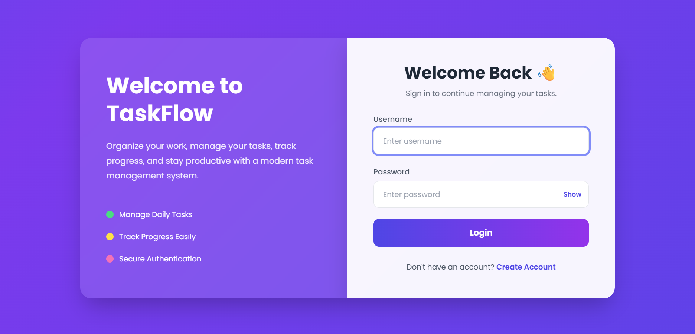
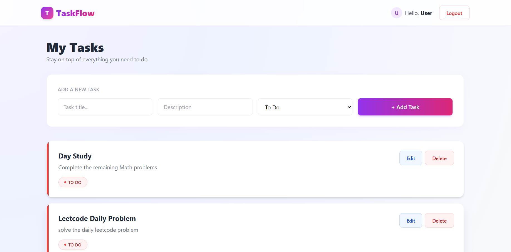

# TaskFlow - Task Management System

TaskFlow is a modern **Task Management Web Application** built using **Spring Boot** following the **Spring MVC architecture**. It enables users to securely manage their daily tasks through an intuitive and responsive interface.

The application implements secure authentication using **Spring Security**, persistent data storage with **Spring Data JPA (Hibernate)** and **MySQL**, and server-side rendering using **Thymeleaf**.

---

## Features

- User Registration & Login
- Secure Authentication with Spring Security
- Create Tasks
- Edit Tasks
- Delete Tasks
- Track Task Status
  - To Do
  - In Progress
  - Done
- User-specific Task Management
- MySQL Database Integration
- Responsive UI using Tailwind CSS

---

## Application Screenshots

### Login Page

<p align="center">
  
</p>

### Registration Page

<p align="center">
  
</p>

### Dashboard

<p align="center">
  
</p>

---

## Technology Stack

### Backend
- Java
- Spring Boot
- Spring MVC
- Spring Security
- Spring Data JPA
- Hibernate

### Frontend
- Thymeleaf
- HTML5
- Tailwind CSS

### Database
- MySQL

### Build Tool
- Maven

---

## Project Structure

```text
TaskFlow
│
├── src
│   ├── main
│   │   ├── java
│   │   │   └── com.taskmanagement
│   │   │       ├── config
│   │   │       ├── controller
│   │   │       ├── model
│   │   │       ├── repository
│   │   │       ├── service
│   │   │       └── TaskManagementApplication.java
│   │   │
│   │   └── resources
│   │       ├── templates
│   │       ├── static
│   │       └── application.properties
│
├── img
├── pom.xml
└── README.md
```

---

## Installation & Setup

### Clone the Repository

```bash
git clone https://github.com/PranayChavan2004/TaskManagement-App.git
```

Navigate to the project directory:

```bash
cd TaskManagement-App
```

### Configure MySQL

Create a database:

```sql
CREATE DATABASE taskmanager_app;
```

Update your `application.properties`:

```properties
spring.datasource.url=jdbc:mysql://localhost:3306/taskmanager_app
spring.datasource.username=username
spring.datasource.password=your_password

spring.jpa.hibernate.ddl-auto=update
spring.jpa.show-sql=true
spring.jpa.properties.hibernate.dialect=org.hibernate.dialect.MySQLDialect
```

### Run the Application

Using Maven:

```bash
mvn spring-boot:run
```

Or run `TaskManagementApplication.java` from your IDE.

---

## Authentication

The application provides:

- User Authentication
- Password Encryption
- Secure Session Management
- Route Protection

---

## CRUD Operations

- Add Tasks
- View Tasks
- Update Tasks
- Delete Tasks
- Track Task Status

---


## Developer

**Pranay Chavan**

